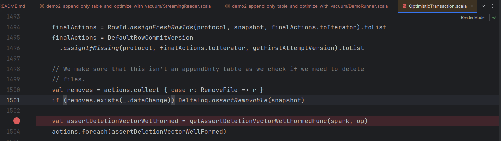
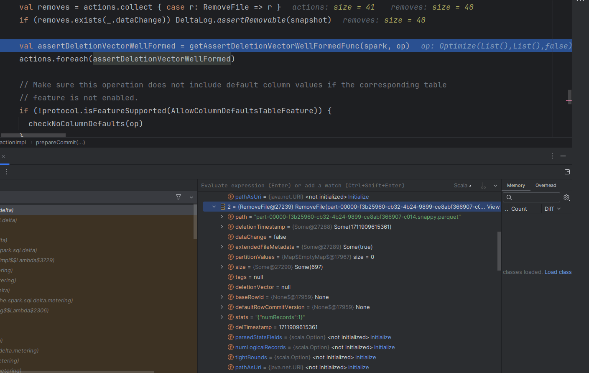

# Append-only table and OPTIMIZE with VACUUM
1. Explain the [DemoRunner.scala](DemoRunner.scala)
* the job starts by setting up the context, i.e. creating the table with some data
* next, the job starts the streaming query
* finally, the job performs table maintenance operations that indeed rewrite the data but not in the sense of append-only
  table
  * an update from the append-only table standpoint is an in-place operation overwriting the data, e.g. via an UPDATE
    or DELETE command
2. Run the `DemoRunner`. Unlike the _demo1_, it shouldn't fail.
3. You can rerun the Demo with the breakpoint added to the `OptimisticTransaction` file, like 1503:
 

It shows that the compacted and vacuumed files are not _data changes_:
 

